# DataDog Hiring Exercise

Author: [Charles Johnson](http://github.com/charlesjohnson)

## Introduction

Thank you for the opportunity to apply for the Solutions Engineer position at DataDog. It's a great opportunity and I hope that my work for this exercise will be a good indicator of my suitability for the role.

## Approach

I approached this hiring exercise with a few key choices:

1. Use Test Kitchen. I find kitchen.yml files way easier to deal with than Vagrantfiles or Dockerfiles.
2. Use Vagrant with Test Kitchen. Docker / Dokken is more lightweight, but I wanted the flexibility to log in and mutate system state in a sticky way as I developed and experimented.
3. Use automation wherever possible. Everything here should be easily reproducible by others. (This fell off for the APM exercise.)
4. Document everything.

## Environment Setup!

1. Install the latest [Vagrant](http://vagrantup.com)
2. Install the latest [Virtualbox](http://virtualbox.org)
3. Install the latest [ChefDK](http://downloads.chef.io)
4. Clone the hiring exercise repository

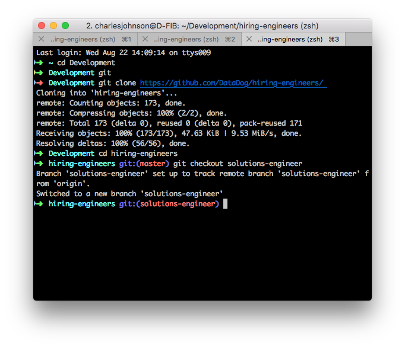
5. Generate the Chef cookbook that's going to automate all of this for us

```bash
chef generate cookbook datadog-hiring-engineers
```

The main chef recipe to provision everything is at `hiring-engineers-cookbook/recipes/default.rb.` It is documented with comments, but the main loop is:

1. Ensure the datadog agent & chef handler are installed.
2. Ensure mysql is installed.
3. Ensure DataDog is set up to collect metrics from this mysql instance.
4. Ensure that my custom check is installed.

To test it: First edit the file to set your API and application keys. Then:

```bash
cd hiring-engineers
kitchen converge
```

## Collecting Metrics!

Here's the host map:
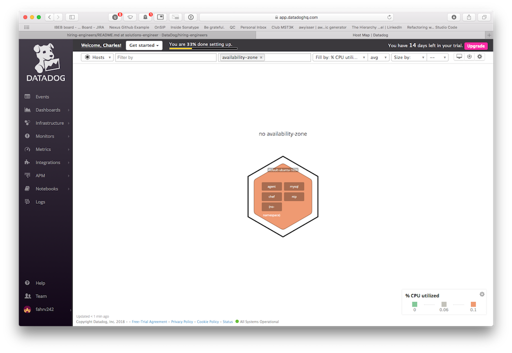

Some Dashboards:
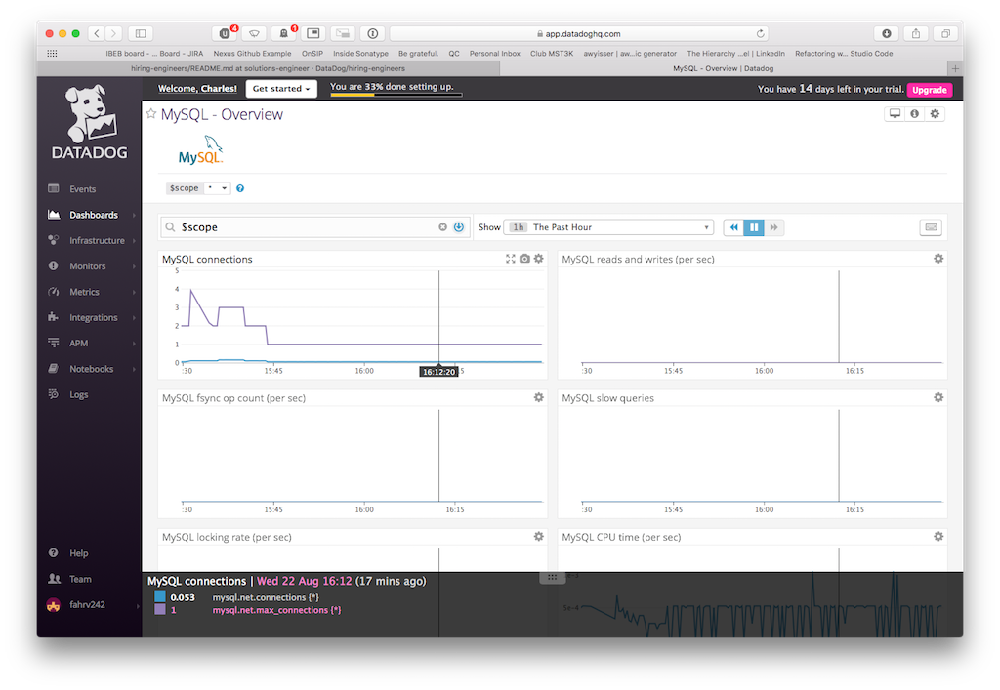
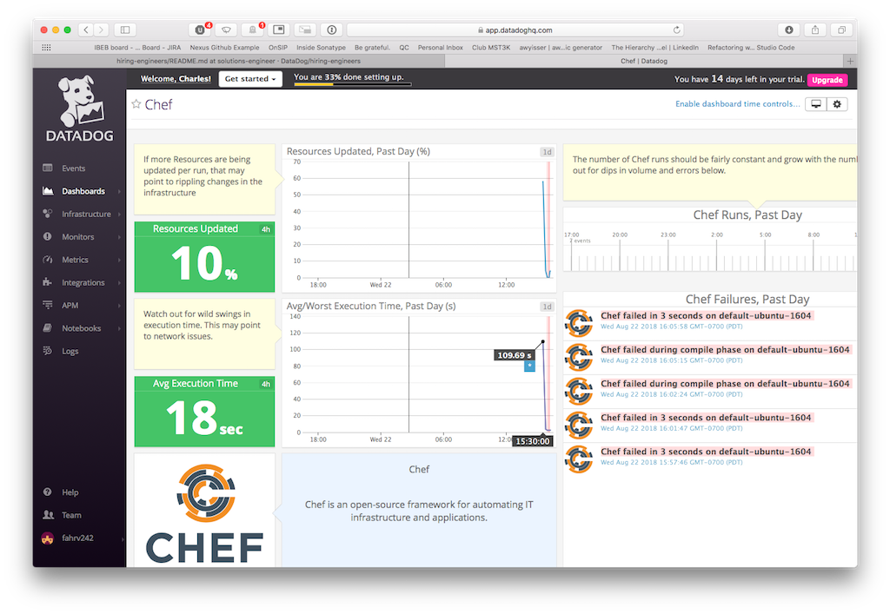
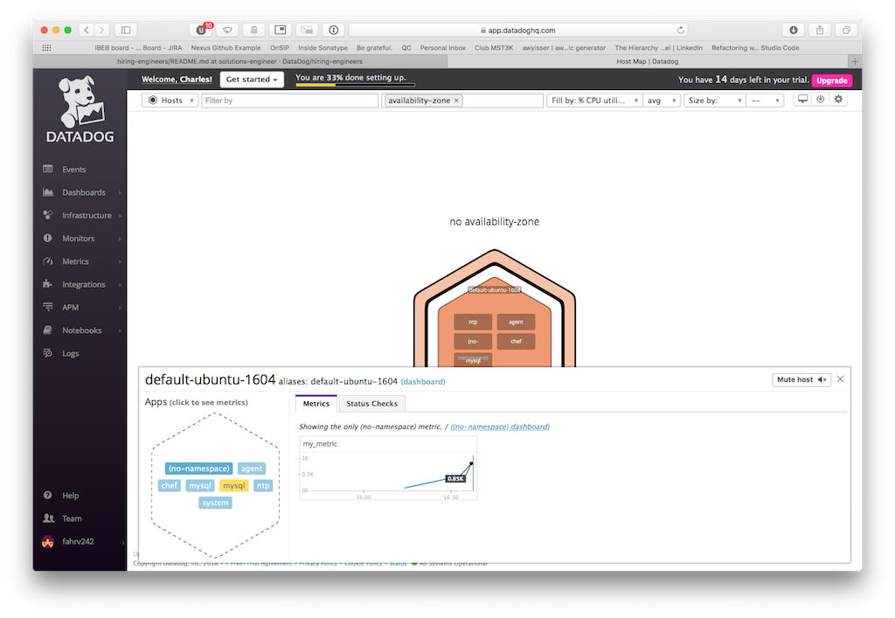

**Bonus Question** Can you change the collection interval without modifying the Python check file you created?

** Bonus Answer** The collection interval is controlled via the yaml config file for this check, which is fed by a Chef template variable. It can be updated within the recipe and re-applied at will.

## Visualizing Data!

I was originally going to do this all in Ruby because that's what was already in front of me, but after loading the `dogapi` gem, there didn't appear to be methods tied directly to timeboards. Instead I decided to render the timeboard via Python.

Because the timeboard creation script is designed to run from an administrator workstation, not from a monitored host, it is not part of the automation suite. Instead this script is stored in the root of the project at `scripts/create_timeboard.py`, and can be executed from a workstation once your own API key and app key have been supplied.

Link to the timeboard: [Hiring Engineer Timeboard](https://app.datadoghq.com/dash/895842/hiring-engineer-timeboard)

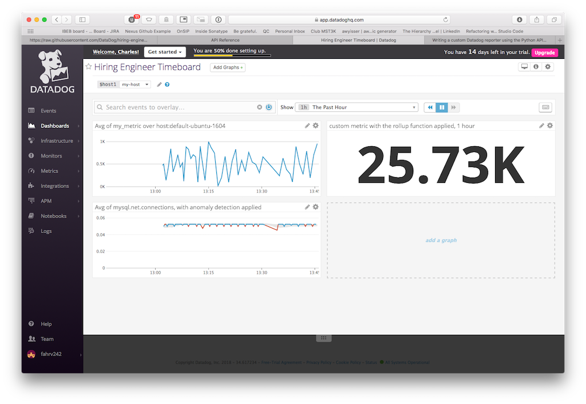

Timeboard set to 5 minutes with an @notified comment applied:

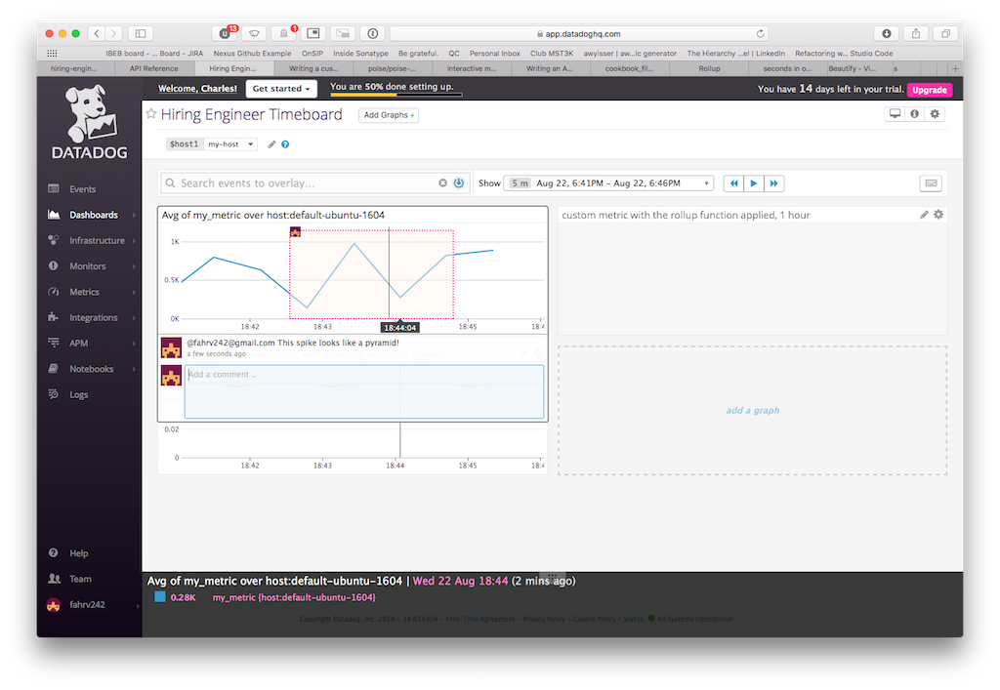

(This was tricky! The GUI didn't want me setting granularity below 1 hour. I had to use the keyboard hotkeys to bring the granularity finer.)

**Bonus Question** What is the Anomaly graph displaying?
**Bonus Answer** The anomaly graph is displaying a gray area which indicates the expected bounds for the metric, based on the chosen algorithm. The red areas of the graph are any recorded metric which falls outside those expected bounds, as configured by the user.

## Monitoring Data!

This section was completed 100% via GUI manipulation, rather than scripting. This was done for expediency: This exercise has been time-consuming and while I'd like to script the whole thing, I've also proven my ability by this point.

The monitor, as configured:

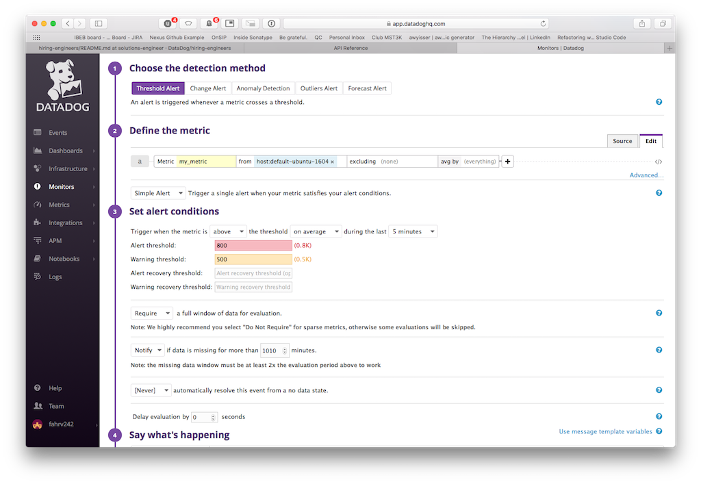
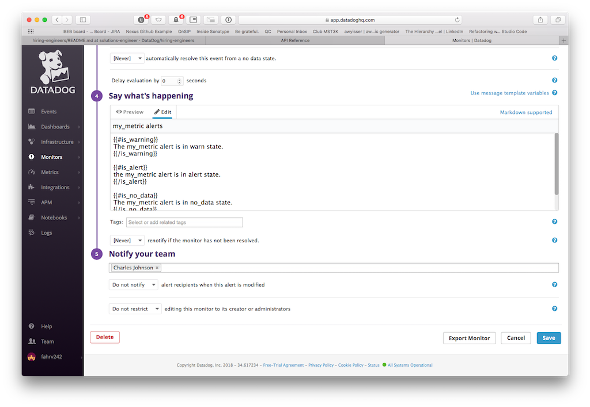

The monitor-created email, as expected:

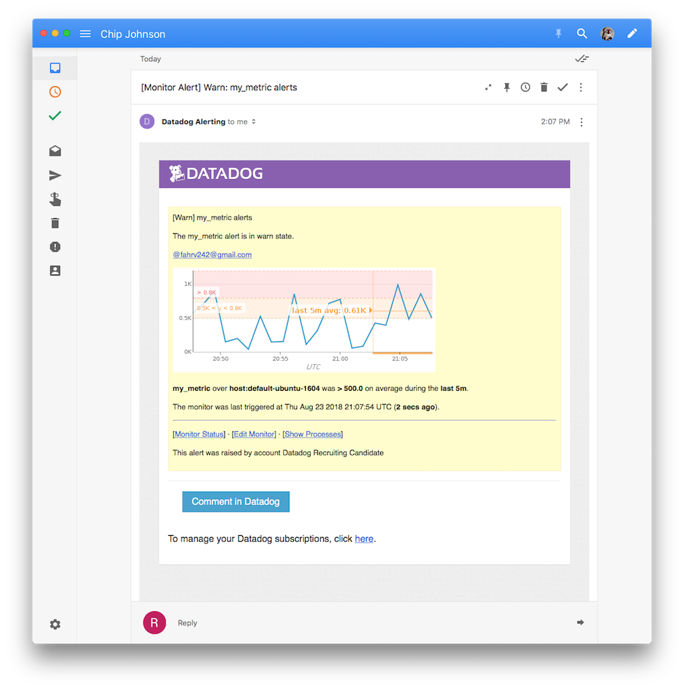

* **Bonus Question**: Since this monitor is going to alert pretty often, you don’t want to be alerted when you are out of the office. Set up two scheduled downtimes for this monitor:

  * One that silences it from 7pm to 9am daily on M-F,
  * And one that silences it all day on Sat-Sun.
  * Make sure that your email is notified when you schedule the downtime and take a screenshot of that notification.

** BONUS ANSWERS**

Scheduled downtime that silences the monitor from 7pm to 9am daily on M-F

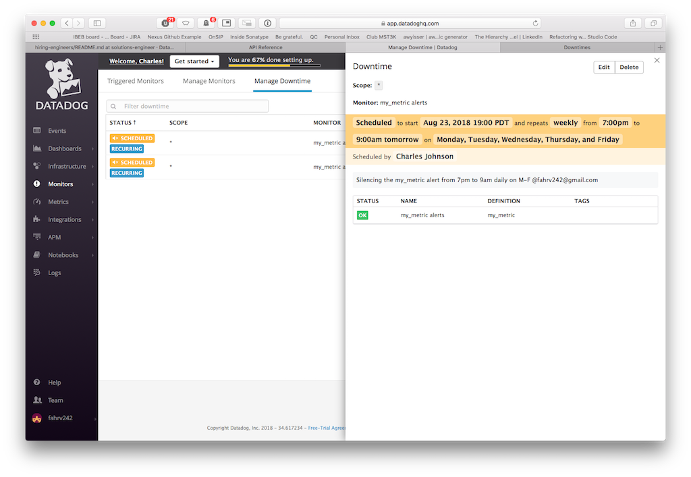

Scheduled downtime that silences the monitor all day on Sat-Sun.

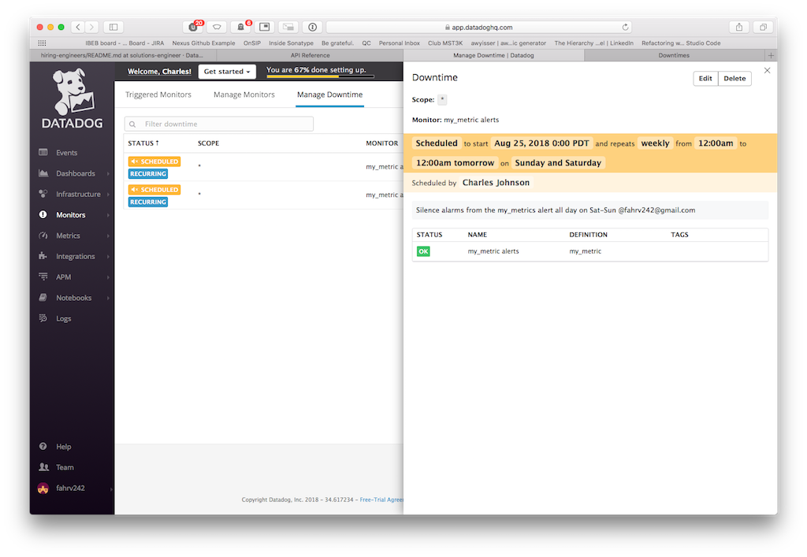

Email notification for one of the scheduled downtimes.

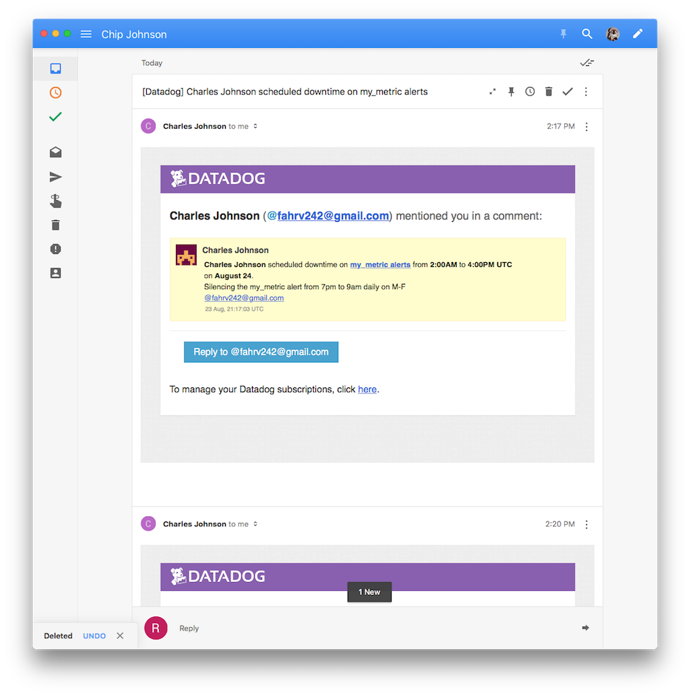

## Collecting APM Data!

For this step, I had Chef install the Flask application into the VM, since that's where I had the DD agent. Rather than deal with trying to get a process supervisor around the flask app and export port 5050 from a test kitchen VM, I just did the lame thing and used `kitchen login` to ssh into the vm, then ran the flask app by hand. A few curl GETs to localhost to tickle the API, and I had results. Not the most elegant but it was quick.

The instrumented Flask script is in the cookbook at `files/apm_flask.py`.

Dashboard Link: [APM and Infrastructure Metrics mixed](https://app.datadoghq.com/screen/418542/apm-and-infrastructure-metrics-mixed)

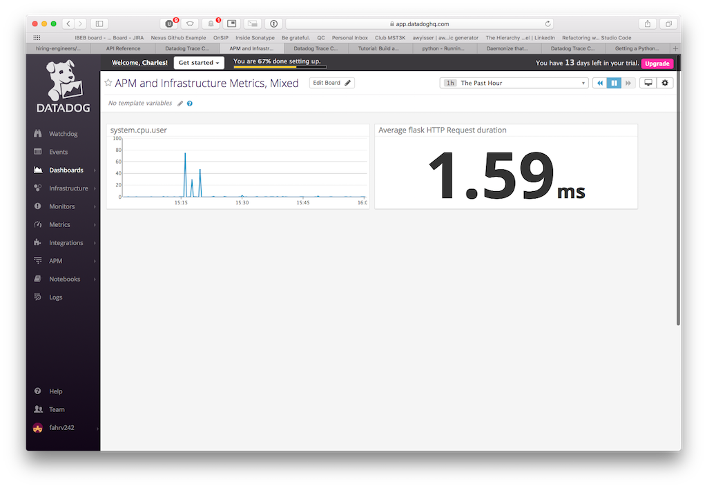

**Bonus Question**: What is the difference between a Service and a Resource?

**Bonus Answer** Pasted from the docs: "A "Service" is the name of a set of processes that work together to provide a feature set." That is, a service could be comprised of a web server, a database, an app server, a cache server, etc. All of these together provide the service.

Again pasted from the docs: "A resource is a particular query to a service." For a webapp, an API endpoint could be a resource. For a database, the actual SQL query would be the resource. 

A service may have many thousands of resources, across multiple processes.

## Final Question

Creative uses of DataDog: With a newborn on the way in a matter of days, I'm curious to track her sleep and feeding patterns. While I'm not sure how we could instrument her mother, being able to instrument for motion and noise from the baby monitor, and provide a simple Dash-button style interface to click record events could make for interesting trend data over time.

## Conclusion

Thank you again for the opportunity to apply for this position. I enjoyed completing this exercise, and hope to speak more with the DataDog team soon.
